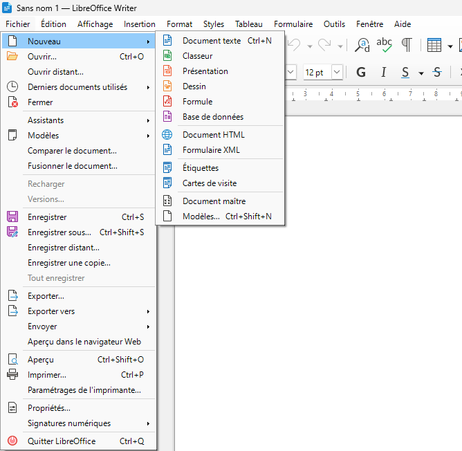

# Guide d'utilisation - LibreOffice Writer (Windows 10/11)

:::note Version utilisée
Ce guide utilise la version **26.2.0** de LibreOffice Writer
:::

## 1. Mise en contexte

LibreOffice Writer est un traitement de texte libre et gratuit qui permet de créer et modifier des documents texte. Ce guide présente les fonctionnalités de base pour les utilisateurs débutants qui souhaitent créer et enregistrer leurs premiers documents.

:::info Public cible
Ce guide s'adresse aux utilisateurs débutants (personnel et étudiants) qui n'ont jamais utilisé LibreOffice Writer.
:::

## 2. Prérequis

- LibreOffice doit être installé sur le poste
- Droits d'utilisateur standard (aucun droit administrateur requis)

## 3. Fonctionnalité A : Créer un nouveau document

### 3.1 Mise en contexte

La création d'un nouveau document est la première étape pour commencer à travailler dans LibreOffice Writer. Cette action ouvre une page vierge prête à recevoir du texte.

### 3.2 Prérequis

- LibreOffice Writer doit être installé

### 3.3 Procédure

Pour créer un nouveau document :

1. Ouvrir LibreOffice Writer depuis le menu Démarrer de Windows.
2. Une fois Writer ouvert, cliquer sur **Fichier** dans la barre de menus.
3. Cliquer sur **Nouveau**.
4. Cliquer sur **Document texte**.

:::tip Alternative rapide
Vous pouvez également utiliser le raccourci clavier **Ctrl + N** pour créer un nouveau document.
:::

### 3.4 Résultat attendu

Un nouveau document vierge s'affiche dans la zone de travail. Le titre de la fenêtre indique "Sans nom 1" ou un nom similaire. Le curseur clignote dans la page, prêt à recevoir du texte.

### 3.5 Erreurs fréquentes

**Erreur** : Plusieurs fenêtres de LibreOffice s'ouvrent.
- **Cause** : Appui multiple sur le raccourci Ctrl + N ou double-clic répété sur Nouveau.
- **Solution** : Fermer les fenêtres supplémentaires en cliquant sur le X en haut à droite.

**Erreur** : Le menu Fichier ne répond pas.
- **Cause** : LibreOffice est en cours de chargement.
- **Solution** : Attendre quelques secondes que l'application soit complètement chargée.

## 4. Fonctionnalité B : Enregistrer un document

### 4.1 Mise en contexte

L'enregistrement permet de sauvegarder le travail effectué sur le disque dur. LibreOffice Writer offre deux options : **Enregistrer** pour sauvegarder les modifications d'un fichier existant, et **Enregistrer sous** pour créer une nouvelle copie ou modifier le nom ou l'emplacement.

### 4.2 Prérequis

- Un document doit être ouvert dans Writer
- Droits d'écriture dans le dossier de destination

### 4.3 Différence entre "Enregistrer" et "Enregistrer sous"

**Fonction Enregistrer (Ctrl + S)**
- Utilisation : Pour sauvegarder les modifications d'un fichier déjà enregistré
- Comportement : Écrase le fichier existant sans demander de nom ou d'emplacement

**Fonction Enregistrer sous**
- Utilisation : Pour enregistrer un nouveau document OU créer une copie avec un autre nom ou emplacement
- Comportement : Ouvre une boîte de dialogue pour choisir le nom et l'emplacement

:::warning Important
La première fois que vous enregistrez un nouveau document, "Enregistrer" et "Enregistrer sous" auront le même comportement : une boîte de dialogue s'ouvrira pour choisir le nom et l'emplacement.
:::

### 4.4 Procédure : Enregistrer un nouveau document (première fois)

Pour enregistrer un document pour la première fois :

1. Cliquer sur **Fichier** dans la barre de menus.
2. Cliquer sur **Enregistrer** (ou utiliser **Ctrl + S**).
3. Dans la boîte de dialogue qui s'ouvre, naviguer vers l'emplacement souhaité (ex. : Documents, Bureau).
4. Dans le champ **Nom**, saisir un nom descriptif pour le fichier (ex. : "Rapport_2026").
5. Vérifier que le **Type de fichier** est "ODF Text Document (.odt)" (format par défaut).
6. Cliquer sur le bouton **Enregistrer**.

### 4.5 Procédure : Enregistrer les modifications (fichier existant)

Pour enregistrer les modifications d'un fichier déjà enregistré :

1. Utiliser le raccourci **Ctrl + S**.

**OU**

1. Cliquer sur **Fichier** dans la barre de menus.
2. Cliquer sur **Enregistrer**.

:::tip Bon réflexe
Enregistrez régulièrement votre travail avec **Ctrl + S** pour éviter la perte de données en cas de problème.
:::

### 4.6 Procédure : Enregistrer sous (créer une copie)

Pour créer une copie avec un nom ou emplacement différent :

1. Cliquer sur **Fichier** dans la barre de menus.
2. Cliquer sur **Enregistrer sous**.
3. Choisir un nouvel emplacement si souhaité.
4. Saisir un nouveau nom dans le champ **Nom**.
5. Modifier le **Type de fichier** si nécessaire (ex. : .docx pour Microsoft Word).
6. Cliquer sur **Enregistrer**.

### 4.7 Choix du nom de fichier

**Bonnes pratiques pour nommer un fichier :**

- Utiliser un nom descriptif (ex. : "Lettre_motivation_2026" plutôt que "Document1")
- Éviter les caractères spéciaux comme : / \ : * ? " < > |
- Privilégier les underscores (_) ou tirets (-) aux espaces
- Inclure une date si pertinent (ex. : "Rapport_2026-02-16")

### 4.8 Choix de l'emplacement

**Emplacements courants :**

- **Documents** : emplacement par défaut recommandé pour les fichiers personnels
- **Bureau** : pour un accès rapide temporaire
- **Dossiers personnalisés** : pour organiser par projet ou catégorie
- **Clé USB** : pour la portabilité (attention aux risques de perte)

:::warning Attention
Évitez d'enregistrer des fichiers importants sur le Bureau. Privilégiez le dossier Documents avec une organisation en sous-dossiers.
:::

### 4.9 Résultat attendu

Après l'enregistrement :
- Le titre de la fenêtre affiche le nom du fichier choisi (sans "Sans nom")
- Le fichier est présent dans l'emplacement sélectionné
- Les modifications futures peuvent être enregistrées avec **Ctrl + S** sans ouvrir de boîte de dialogue

Pour vérifier :
1. Ouvrir l'Explorateur de fichiers Windows.
2. Naviguer vers l'emplacement choisi.
3. Vérifier la présence du fichier avec le nom attribué.

### 4.10 Erreurs fréquentes

**Erreur** : Message "Le fichier existe déjà. Voulez-vous le remplacer ?"
- **Cause** : Un fichier avec le même nom existe déjà à cet emplacement.
- **Solution** : Choisir un nom différent ou confirmer le remplacement si vous souhaitez écraser l'ancien fichier.

**Erreur** : Message "Accès refusé" ou "Impossible d'enregistrer"
- **Cause** : Droits insuffisants dans le dossier de destination ou fichier ouvert ailleurs.
- **Solution** : Choisir un autre emplacement (ex. : Documents) ou fermer le fichier s'il est ouvert dans un autre programme.

**Erreur** : Le fichier n'apparaît pas dans le dossier choisi
- **Cause** : Enregistrement annulé ou mauvais emplacement sélectionné.
- **Solution** : Recommencer l'enregistrement en vérifiant bien l'emplacement dans la boîte de dialogue.

**Erreur** : Perte de travail après fermeture sans enregistrer
- **Cause** : Oubli d'enregistrer avant de fermer Writer.
- **Solution** : Toujours enregistrer avec **Ctrl + S** régulièrement. Writer affiche un avertissement si des modifications non enregistrées existent lors de la fermeture.

:::tip Bon réflexe
Prenez l'habitude d'enregistrer votre travail toutes les 5-10 minutes avec **Ctrl + S**.
:::

## 5. Métadonnées

- **Version du document** : 1.0
- **Dernière mise à jour** : 2026-02-16
- **Version de LibreOffice** : 26.2.0
- **Public cible** : utilisateurs débutants (personnel et étudiants)
- **Système d'exploitation** : Windows 10/11